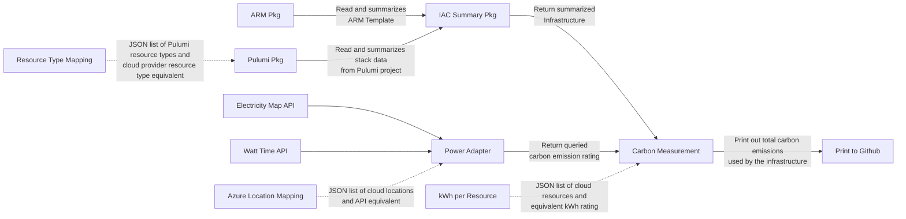

# Documentation Overview

This repository contains examples to demonstrate how to measure carbon during the development process.

## Related

- **[How to contribute](../CONTRIBUTING.md)**
- **[Our code of conduct](../CODE_OF_CONDUCT.md)**

## Folder Structure

- docs - documentation, process flows and state diagrams, and technical architecture.
- test - automated tests
- pkg - packages to access other resources
- references - data reference used by the application
- .vscode - configuration and recommendations for the VS Code IDE.
- .devcontainer - default configuration for GitHub codespaces or containerized development.

## Application Diagram



## Definition of Done

What must happen for the GitHub Issue to be marked as complete.

1. Documentation added to a markdown file.
2. Unit test cases written.
3. The code has been peer reviewed.

## How to Use the GitHub Action

### Usage Example
```yaml
- name: Calculate Carbon
  uses: Green-Software-Foundation/Carbon_CI_Pipeline_Tooling@main
  with:
    IACFile: arm.json
    IACType: arm
    CloudProvider: azure
    CARBON_RATE_PROVIDER: electricitymap
  env:
    ELECTRICITY_MAP_AUTH_TOKEN: ${{ secrets.ELECTRICITY_MAP_AUTH_TOKEN }}
    WATT_TIME_USER: ${{ secrets.WATT_TIME_USER }}
    WATT_TIME_PASS: ${{ secrets.WATT_TIME_PASS }}
```

### Inputs

|Name|Description|Required|Default Value|
|--|--|--|--|
|IACFile|File name of the infrastructure code. Location is relative to the root folder.|true|infra.json|
|IACType|Type of the infrastructure as code. <br/>Must be any of the following:<br/>**arm**, **bicep**, **pulumi***.<br/><br/>*See additional information below.|true|arm|
|CloudProvider|Cloud provider. Currently, only **azure** is supported.|true|azure|
|CARBON_RATE_PROVIDER|Your resource for CO2 data.<br/>If you are using Electricity Map, type **electricitymap**.<br/>If you are using Watt Time, type **watttime**.|true||


### Environment Variables

This GitHub action uses data from third-party providers to compute for the estimated power consumption and carbon emmission of the infrastructure of your application. You'd need to provide credentials to these third-party providers to be able to use their data by passing the values under the **env** section.
|Name|Description|Required|Default Value|
|--|--|--|--|
|ELECTRICITY_MAP_AUTH_TOKEN|If you are using Electricity Map, supply the **Authentication Token** or **Zone Key** to use. This uses GitHub Secret named **ELECTRICITY_MAP_AUTH_TOKEN**|false||
|WATT_TIME_USER|If you are using Watt Time, supply the username. This uses GitHub secret named **WATT_TIME_USER**|true||
|WATT_TIME_PASS|If you are using Watt Time, supply the password. This uses GitHub secret named **WATT_TIME_PASS**|true||


### Pulumi

If you are using Pulumi for your IaC, you'll have to generate 2 JSON files:

1. list of deployed resources on selected stack (`pulumi stack`)
2. preview of updates to do to the selected stack (`pulumi preview`)

To execute those Pulumi commands successfully, there are some steps you need to add to your workflow. Following is the list of steps to successfully generate those files.

1. Log in to your cloud provider's CLI. Depending on your cloud provider, you can either use an official action from the marketplace (if available) or manually execute the login command of your cloud provider's CLI.

2. Install dependencies of your Pulumi project. This will vary according the language you use on your project.

3. Optional: Select a stack.

4. Generate the list of resources on selected stack and save it as a JSON file by executing `pulumi stack export --file stack.json`. This will save the data on the current directory as stack.json, you can choose any filename you want.

5. Generate the preview of updates to do by executing `pulumi preview`. If you are using Linux on your runner, execute `pulumi preview -j | tee preview.json`. If you are using Windows, execute `pulumi preview -j > preview.json`. This will save the data on the current diretory as preview.json, you can choose any filename you want.

6. Use this Gitub action and point it to the 2 JSON files the were generated.

```yaml
- name: Calculate Carbon
  uses: Green-Software-Foundation/Carbon_CI_Pipeline_Tooling@main
  with:
    IACFile: "stack.json,preview.json"
    IACType: pulumi
    CloudProvider: azure
    CARBON_RATE_PROVIDER: electricitymap
  env:
    ELECTRICITY_MAP_AUTH_TOKEN: ${{ secrets.ELECTRICITY_MAP_AUTH_TOKEN }}
    WATT_TIME_USER: ${{ secrets.WATT_TIME_USER }}
    WATT_TIME_PASS: ${{ secrets.WATT_TIME_PASS }}
```
