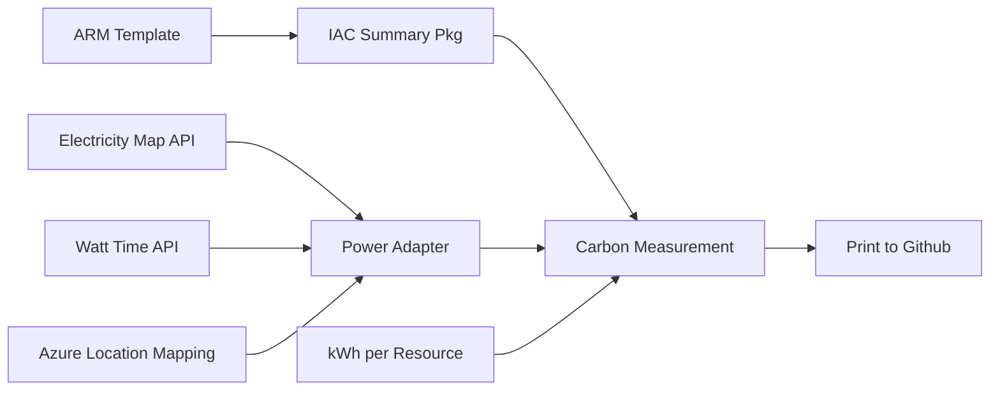

# Documentation Overview

This repository contains examples to demonstrate how to measure carbon during the development process.

## Related

- **[How to contribute](../CONTRIBUTING.md)**
- **[Our code of conduct](../CODE_OF_CONDUCT.md)**

## Folder Structure

- docs - documentation, process flows and state diagrams, and technical architecture.
- test - automated tests
- pkg - packages to access other resources
- references - data reference used by the application
- .vscode - configuration and recommendations for the VS Code IDE.
- .devcontainer - default configuration for GitHub codespaces or containerized development.

## Application Diagram

## Definition of Done

What must happen for the GitHub Issue to be marked as complete.

1. Documentation added to a markdown file.
2. Unit test cases written.
3. The code has been peer reviewed.
